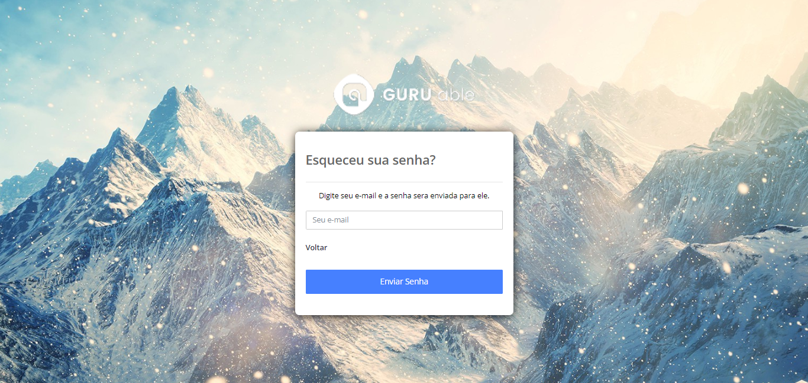

<h1 align="center">ESCOLA EAD COLUMBIA - THE NEW SCHOOL</h1>

Este projeto foi criado com o intuito de praticar habilidades básicas da linguagem de programação PHP em conjunto com a linguagem SQL. Algumas das funcionalidades implementadas
foram: criptografia de senhas, enviar e-mails com PHP, enviar imagens.

<h2>Tela de Login</h2>

<h2>Tela Resetar Senha</h2>

<h2>Tela Inicial - PAINÉL DE ADMINISTRADOR</h2>

<h2>Tela de Perfil</h2>

<h2>Tela Gerenciar Cursos</h2>

<h2>Tela Cadastrar Cursos</h2>

<h2>Tela Gerenciar Usuarios</h2>

<h2>Tela Cadastrar Usuarios</h2>

<h2>Tela Relatórios</h2>

<h2>Tela Loja de Cursos - PAINÉL USUÁRIO PADRÃO</h2>

<h2>Tela Meus Cursos - PAINÉL USUÁRIO PADRÃO</h2>

<h3>Banco de Dados</h3>

Na pasta bdTables, estão todas as tabelas do banco de dados. Abra o SGBD, crie um banco de dados
chamado "escola_ead", e importe todos os arquivos para dentro.

<h3>Usuarios Cadastrados</h3>

Usuario 1: Jose Maria Filho 
Email: josemaria@gmail.com 
Senha: josemaria 
Status: Administrador

Usuario 2: Maria Jose Filha
Email: mariajose@gmail.com 
Senha: mariajose 
Status: Usuário Padrão

